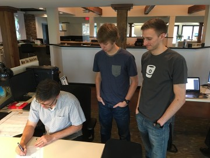
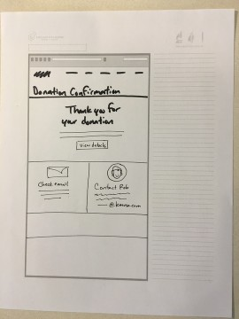
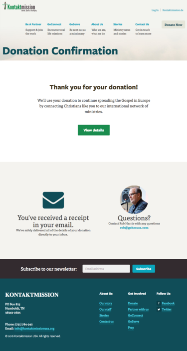

There's something special about sketching. Sketching is how you can communicate an idea, and register the creative side of your brain.

One of our current clients is Kontakt Mission.

A problem we had to solve was reassuring a visitor after they've made a donation to KM.

A mere thank you page just wouldn't do.

## Sketching a solution

At the beginning of every design decision we begin with a sketch. This begins our Designtific Method. We wanted to make sure we have the right layout and solution to build trust after a donation has been made.

It's simple. Just grab a piece of paper and a sharpie and draw the page. Think of the elements that are going to generate satisfaction and relieve any donation remorse.

In our case, here is [William](https://twitter.com/sodiumhalogen) laying out a strategy with a sketch to our developers, Adam and Chance.

## What is the problem we are trying to solve?

It's all about asking the right question.

What does the customer want to see next on a donation thank you page?

- success - they want to see that the transaction went through successfully
- donation details - they might like to see the details of the transaction
- taxes - they'll want to use a receipt for taxes
- support - knowing who to contact if I have any questions

## Pen to paper

OK, with the question answered and the needs of the customer presented, let's sketch up the page.

## From sketch to pixels

All that's left is a little bit of coffee and code. Here is how the page turned up. We present to you the donation confirmation page.

