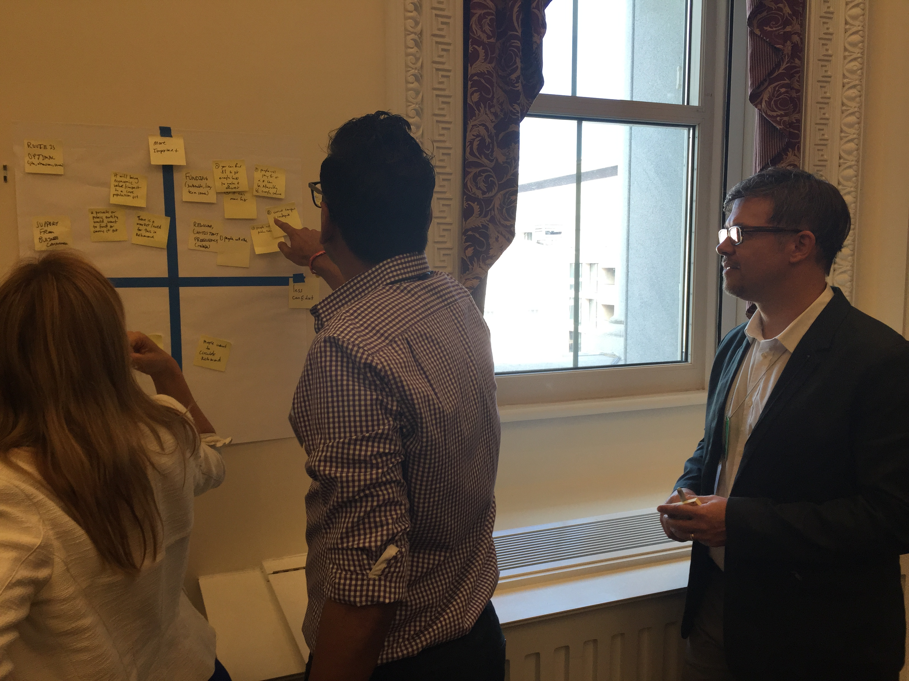

It was almost a year ago that I was honored with being at the White House with my friendtor [Janice Fraser](http://www.twitter.com/clevergirl) and other smart folks from the [Pivotal Labs](http://pivotal.io/labs) team.

I was helping facilitate a workshop for White House staffers. We helped them validate their ideas and brainstorm ways to test those ideas as quickly as possible. We were helping them use principles from Silicon Valley to make government more efficient and effective. Political parties aside, that's something we can all get behind.

These are the same techniques and principles (Lean Startup principles) that Sodium Halogen uses to build effective tools for our client's customers.

These are smart people who genuinely work hard to serve the citizens of the United States. It was awesome to help equip them to do that better. I hope they learned as much as I did.
