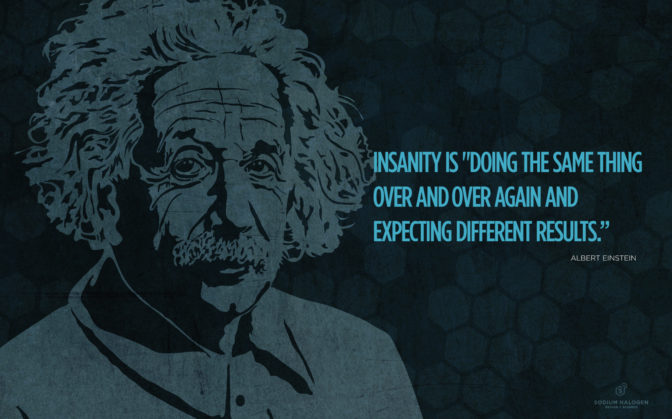

### Einstein once defined insanity as "Doing the same thing over and over again and expecting different results."

It's a nice quote that we have likely all heard, but:

1. Why do I care?
2. How can I act on Einstein's quote?

## Why do I care?

Companies of all sizes are trying to be "innovative like Silicon Valley startups", yet they keep _doing the same things and expecting different results_. Does that sound like your company or organization? I'll admit that it hits pretty close to home for us here at Sodium Halogen. Even though we run experiments all the time, we are often not experiementing on the things that could have the biggest impact. :(

## How can I act on Einstein's quote?

To actually do something with Einstein's quote, start with thinking about your business. What aspect of your business do you always think about in the shower or right before you go to bed at night. Here is a hint - it's probably related to your bottom-line. _A way to make money_. :)

## Now add brainstorming

We always recommend starting with a quick [brainstorm](http://bit.ly/brainstormcheatsheet), so grab a stack of sticky notes and a Sharpie pen. One idea per sticky and (just write a 1-5 word headline) and set a timer for 3 minutes. Brainstorm about something you could change in your company to affect that big bottom-line item. Try to come up with at least 8 sticky ideas. _[thanks Janice](www.twitter.com/clevergirl)_

Maybe it's the messaging on your website's home page, or asking for referrals from existing customers, better social media outreach, etc... Ready? Set the timer and...Go!

## Think of a small experiment to run

After time is up, look at the sticky notes you have in front of you. Pick the one that you think is the most important and set the others aside. Now think about how you could run a small experiment using your top sticky note idea. What could you try if you only had one day to run the experiment? If you only had two hours?

## Now run the experiment!

If the bottom-line idea is really valuable to your company, then you certainly have two hours to one day to try something new right? So create 2 events on your calendar for this week. Schedule a 2 hour meeting this week to "run bottom-line experiment". Then set another calendar event in a week or two to "measure the results of bottom-line experiment".

## How to measure if your experiment worked

How you measure your results will depend on what kind of experiment you are wanting to run, but the most important thing is to determine **up front** what a successfule experiment would look like. Examples might be: two new client leads in two weeks, one more new referral this week, 20% increase in visitors to the site filling out the "request info" form this month.

Just make sure you determine what that success metric is up front.

## But what if it fails?

Making changes can be scary. What if it fails? Well, that is one of the powerful things about making this an experiment. Experiments "fail" all the time, but you always learn something from the experiment. So even if it fails, you'll have a better idea for an experiment in the future (next month?) and you now have experience running a small experiment.

## Make Einstein proud

This next week, try doing something different to get different results. And if you do, then please tell us how it went.
