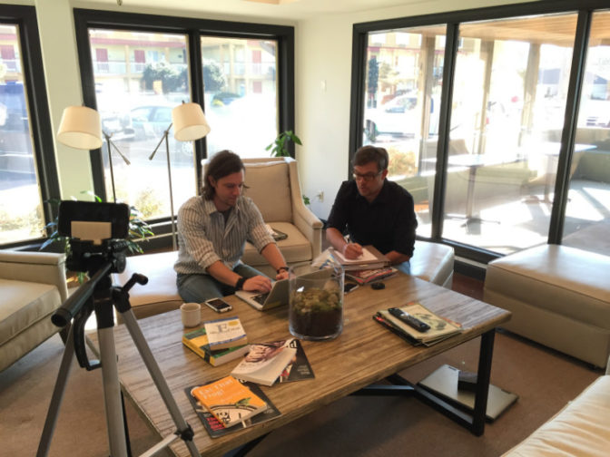

Are you looking for ways to improve your website? Trying to figure out why your site is not converting like you wish it did? Of course you are. Well, there is a sure-fire way to get insights-watch people use your site.

### Sounds Simple

If that sounds simple, that's because it is. But it's a step that lots of web designers and developers overlook due to the fact that it can be scary. What if people get confused? What if visitors don't care about the cool feature you spent so much time creating? That can be nerve racking.

### Gain critical insights

So while it can be nerve wracking, it also is also super insightful. And don't you want to know what's not working? That way you can fix it. Make it less confusing. Make it easier to understand and use.

Ok, now that you've decided to test the site, where do you start?

### First, look at your goals for the site

What is the purpose of your site? What do you want people to do? Fill out a form? Buy now? Sign up for your mailing list? Think about the most important actions you want the visitor to take.

### Pick your top 2-3 actions

These top actions are the tasks you are going to test with real people. Make a list of those actions and bring it with you when you test.

### Find people to test your site

If you have created personas for your site, then you'll want to look at those and think about where you can meet with that type of person. If you don't have personas, then you can simply go to a local coffee shop and look for people that you think could be your customer.

### Ask them for their help and their insights

This part is pretty important. You are not trying to sell this person, so you want to make that clear up front. Make up your own ask based off this example:
"Hi, my name is William, and I am a local business owner (or I'm creating a website for a local business). I'm wanting to make sure the site works right, and I'd like to buy you a cup of coffee to get you to test the website. If you have a few minutes, could you help me out?

### Be friendly, but not pushy

If they say "no", then thank them for their time and ask someone else.

### You are testing the site, not them

Make sure they know they can't do anything wrong. You are testing the site, not them. Just ask them to say out loud what they are thinking. I like to give them a task to complete and then give them an example of what they might be thinking. Something like "I'm looking to buy a book for my wife, so I'm on the home page and I am wondering how to look at what books the site offers."

### Encourage them, but don't save them too quickly

If they get stuck, then give them some time to figure it out. Reassure them that they are "doing great", then maybe ask them a question to help them unstick. "Where do you normally look for that feature? What word or image are you trying to find? How do you find this on other sites?"

### Take notes

Even if you don't have time to write any notes during the testing, give yourself five minutes to make a few notes right after you finish each testing session. Don't wait, or you will forget something important. ;)

### Closing questions to ask them

After they have completed the tasks you have for them, here are two questions I like to ask to wrap it up.
What is your general impression of the site? (encourage them to be honest, not just nice)
How could we make this experience better?

### Rinse and repeat

Be respectful of their time. Give them a few tasks to complete, get their insights, tell them how helpful they have been and then let them get on with their day. Be sure to test with 2-3 people.

### Make improvements and test again

After you have tested with a few people, take your notes back to the rest of your team (or your client). Look for patterns and make improvements to your site based on what you learned. Then test your improvements out on new people.

### Test it out

I want to challenge you to try out this testing thing one time. **It's so simple, but it's part of the secret sauce Sodium Halogen uses to ensure we are building sites that work even better than they look.**
