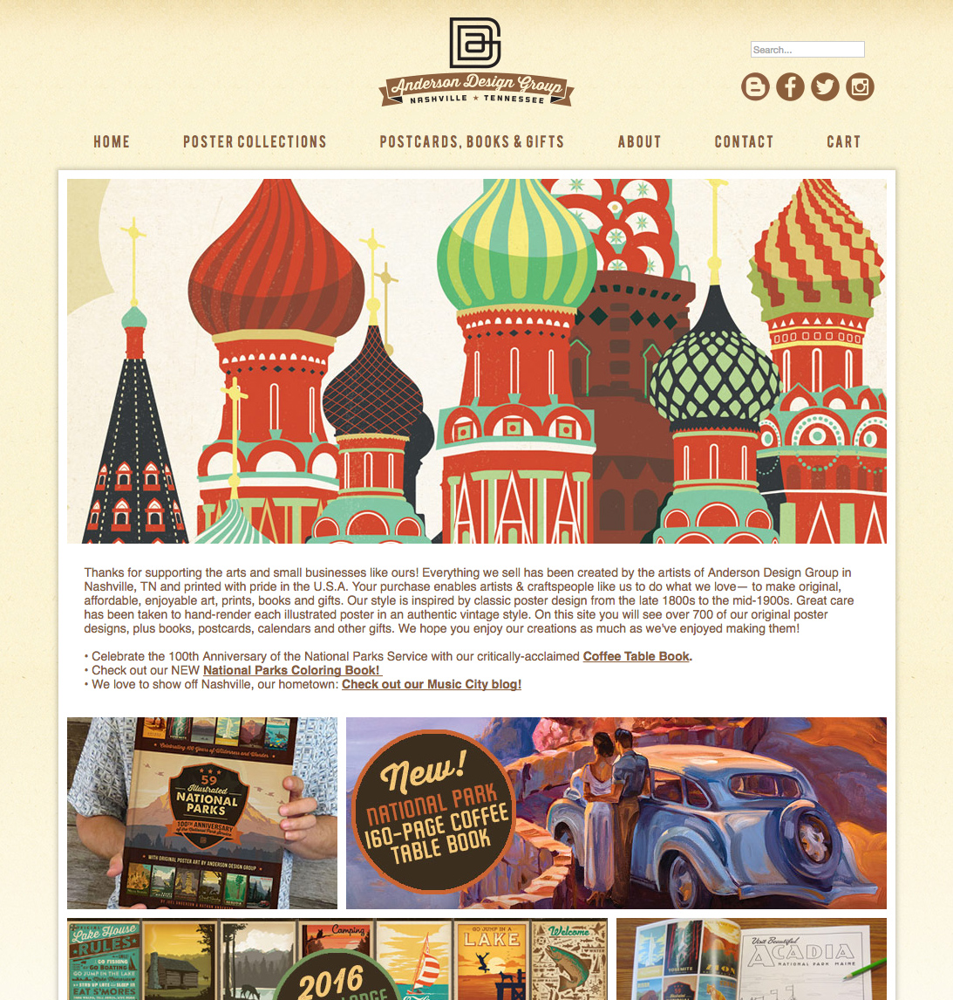
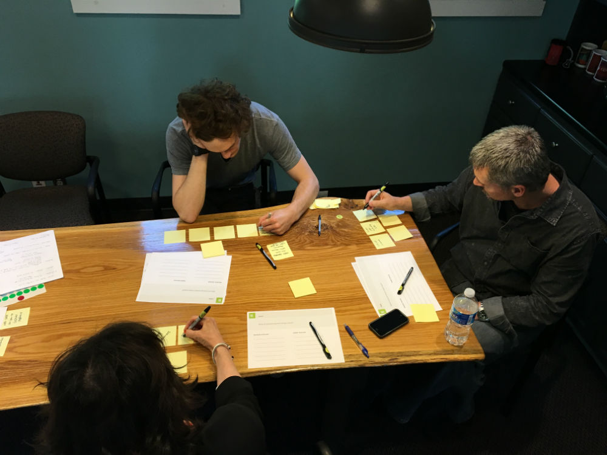
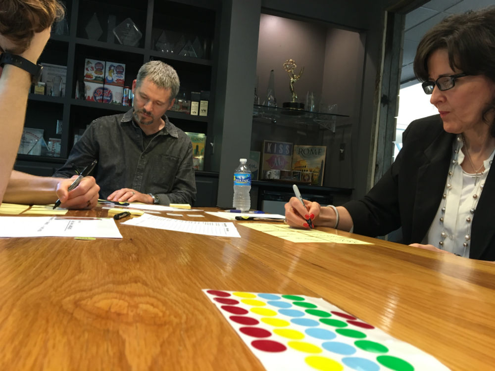
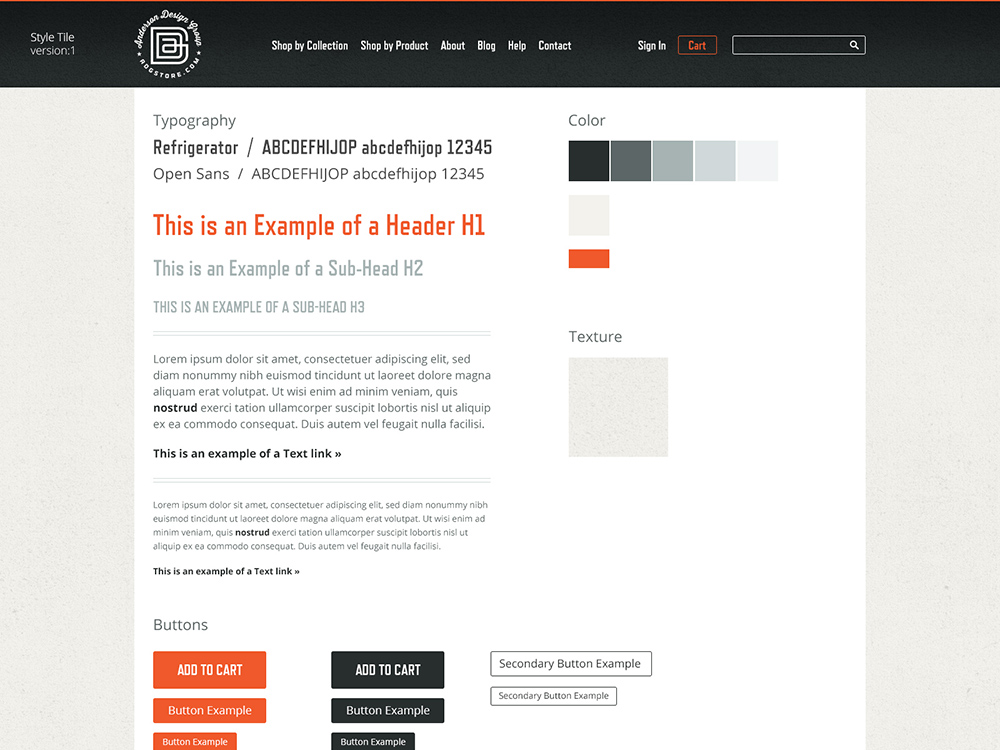
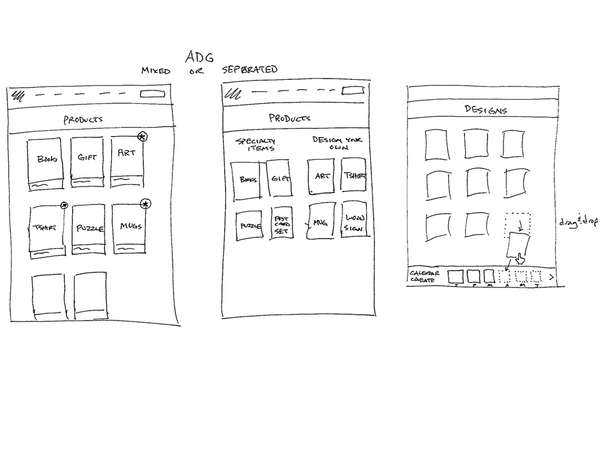
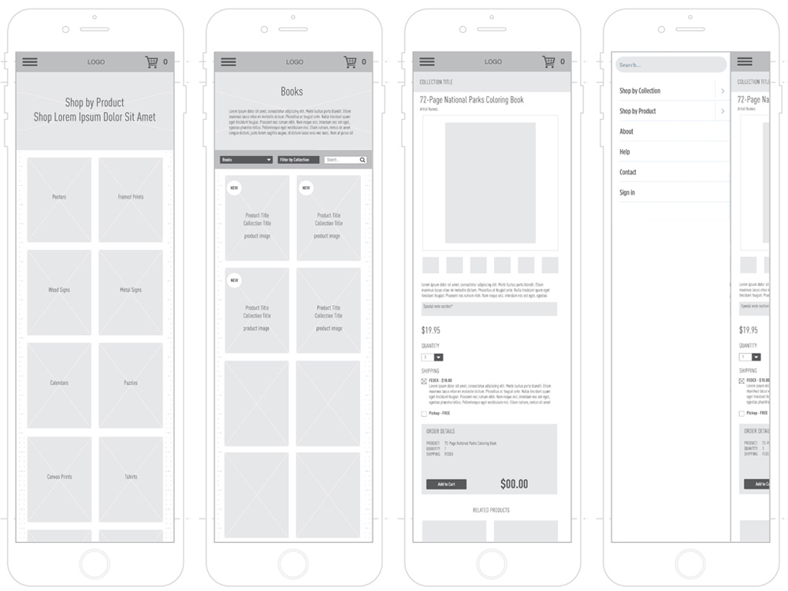
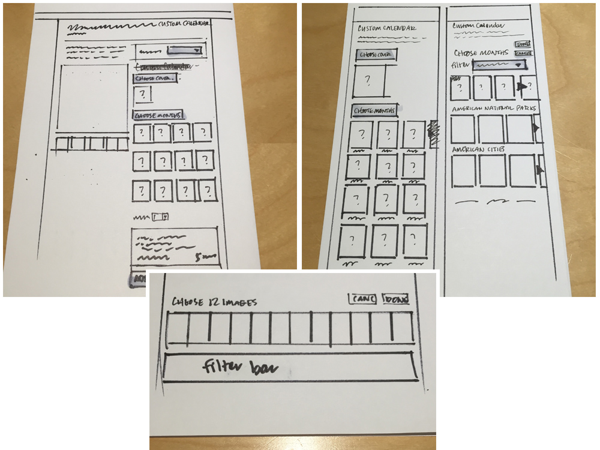

### Anderson Design Group asked us to help them sell more products with a new website.

### We gave them their best Christmas sales season ever.

We are design nerds. We love great design, so we were all-in when our friends at Anderson Design Group reached out about needing a way to put their beautiful art on different mediums.

Anderson Design Group is a studio that created a movement. Joel and his team have been creating amazing Mid-century illustrations for packaging since 1993. They did custom package design, but their design style was so popular they had people asking where the designs could be bought.

<!--more-->

Fast forward to 2007 when ADG began specializing in illustration and poster art.

<cite>This is the old Anderson Design Group home page. Beautiful illustrations, but not focused enough on selling.</cite>

## Hypothesis

### If ADG offers more custom product options with this amazing art, then customers will buy from the source.

Anderson Design had seen great success selling art prints, posters and books. They also licensed their art to other online retailers, but only got a small royalty check when their art was put on things like canvases and metal signs.

Joel wanted to give more sizes and framing options on their best seller - art prints. He also wanted to offer a feature he (or we) had not seen before - custom wall calendars. We would need to come up with an intuitive way for customers to choose 12 different designs (from ADG's more than 800 designs) for their calendar.

[video width="1240" height="808" mp4="http://www.sodiumhalogen.com/wp-content/uploads/2017/01/case-study-adg-home-new.mp4"][/video]

<cite>Here is the new home page, focused on selling designs on all types of products. Was it a success? Keep reading.</cite>

## In the Lab

Since we practice customer-centered design, we start off every project with a Strategy Workshop. We met with the ADG team to determine who their customers were and how we can solve those customers' problems. Together we explored the look and feel of the new site, discussed goals and features to make the project a success - sell more merchandise.

<cite>Kicking off the project with a Strategy Workshop with Anderson Design Group's core team</cite>

<cite>Anderson Design Group's team deep in brainstorming mode</cite>

## Sketches and other artifacts of our Designtific Method

<cite>Section of the style tile we created for the site.</cite>
<cite>We create rough sketches to communicate and validate ideas quickly</cite>
<cite>Wireframes of the mobile view</cite>

## Custom Calendar

One of the most challenging features of the new site was allowing customers to easily choose 12 designs and build their custom calendar.
<cite>Thinking through calendar user flow with sketching</cite>

### Final walk through of the custom calendar flow

[video width="1240" height="808" mp4="http://sodiumhalogen.com/up/case-study-final-calendar-0n4EcYCzF7.mp4"][/video]

## Custom Shopify app

Since at its core this is an eCommerce site, we built the new site on top of Shopify's platform. But since so much of the site is putting 800+ print-on-demand designs on different products, we needed to build a custom Shopify app to bring it all together.

Through research, we know that seeing the size and look of the new art in context will help people visualize what it will look like in their house, so we created a system to auto-generate 90+ images each time Joel's team uploads a new design. It ended up being a beast of a task to make all the elements play nice together, but our team at Sodium Halogen pulled it off and the final customer experience is seamless. The user can add a t-shirt, framed art print, a coffee table book and a printed canvas to their cart and each of those items is fulfilled by a different vendor. #whew

## Designtific Conclusion

[video width="1240" height="808" mp4="http://sodiumhalogen.com/up/case-study-adg-flow-sm-x0k2SgkZIE.mp4"][/video]

<cite>Final walk through of the site</cite>

We love to hear from happy clients, but what really makes us happy is to hear from our client's customers. The new site launched right before the Christmas rush and **broke their record for sales** in December.

Based on the success of this redesign, Joel and his team are looking to add new product types to their site. We can't wait to design and build them.

[Visit the site](https://adgstore.com)

> Put our Designtific Method to work for you.
>
> [GET STARTED > ](http://bit.ly/shform)
