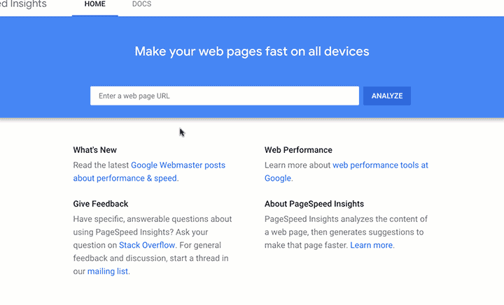

Something that we’ve been looking into improving at Sodium Halogen is the speed of our sites. While it isn’t something that we’ve neglected, we wanted to squeeze out that last bit of performance that would help us stand out. Since we like to experiment, we thought the best way to improve our clients’ sites would be to start by improving our own site. But before going into what we did to improve the speed of our site, let’s talk about why we actually wanted to do this in the first place.

## Why a fast site is important

### Search engines like speed
Having a fast site will improve your SEO rankings for search engines. Most common search engines will test how quickly your websites load, and then use that to rank your site. Gone are the days of using a simple “keywords” meta tag. Search engines like Google use a much more complicated algorithm to rank their results, and speed is an important factor in that.

### Visitors like speed
Having a fast site will also keep visitors on your site longer. If pages are loading slow, they aren’t going to want to stay there. According to Google, visitors to your site are going to get frustrated very quickly if they visit your site and it doesn’t load in 1-2 seconds. That means visitors typically won’t think of your site as being “fast” unless your site loads in under a second, and only about 10% of sites on the web load that fast. If your site takes longer than ~2 seconds to load, you start running a much higher risk of losing visitors to your site before they even have a chance to see your content, because they may leave the site before it loads.

Having a fast site is going to give you more credibility, and visitors more confidence in you. It shows that you’re here to impress. People will enjoy visiting your site when they can click a link and have that new page load immediately. They’ll also be more likely to recommend your site to others because of that positive experience.

## What slows sites down

### Old tech
Sites are often slow due to old technology. When people have sites built, they often have expectations that the site should last much longer than it actually will. Sadly, it’s not uncommon to see outdated, slow, or broken sites on the web. The fact is, technology moves fast, and websites typically should be remade about every 3 years to ensure that not only the design is up to date, but also the technology as well. Our site was on WordPress, which isn’t necessarily considered “old technology” by most, but it definitely isn’t considered cutting edge.

### Images
Images are often the main contributor to slow pages. Large images will take longer to download, and if there are multiple images on a page it adds up fast. This is a problem that often slowly creeps in, as more images are uploaded to the site without considering the size of the image first.

### Quality code
Another major player in site speed is the quality of the code. In programming, there is a term called “best practices.” Essentially, a best practice is when there are multiple ways to do something, but one of those ways is considered the best. Often, and especially in web development, best practices have to do with speed and optimization. When developers don’t use these, it can lead to a slow or unresponsive website. Sometimes this is done as a way to cut corners, but sometimes it’s also done because of a lack of knowledge or care. Sadly, the mindset of many web developers is “the client will never know the difference, so why should I care?” But it shows when the site starts loading slow.

## What we did to speed up our site

### New tech
The first way we sped up our site was to try out some new frameworks. WordPress has been one of the main platforms used for websites (for good reason), but since it’s built on PHP, it can be slow. Because of this we’ve begun looking at other platforms and have started to really enjoy using [Gatsby](https://www.gatsbyjs.org). Gatsby is what’s called a static site generator. So, while WordPress and other PHP sites are generating pages live for visitors every time they visit a site (which can really slow a site down), Gatsby generates the pages once and then sends that to visitors. It’s much more efficient, so pages can load lightning-fast. And the best part? It can be used with virtually any CMS (content management system), so if you really like the backend experience of WordPress, you can still use that. We moved our site over to Gatsby a few months ago, but we realized there were a few more things we could implement to speed up our site, one of those being better image processing.

### Optimize images
When we were on WordPress, we had some basic image optimization implemented. WordPress would generate multiple sizes of each image, and we could choose what size of an image we wanted in a specific section of the site. This was nice, but it still wasn’t the best way to do it. For instance, a header image shouldn’t always be delivered as a 1080px wide image, especially for a phone. We were able to configure Gatsby to automatically detect the width of an image container and deliver a version based on the size of the image on the screen, whether that be a computer monitor or phone screen. So, if I’m using a computer to load the site, I’ll have a large image delivered. But if I’m using my phone, I’ll have a much smaller version of the image delivered. What this means is that now we don’t have to worry about how large individual images are when we add them to our site because they will be automatically resized depending on the size of the container they’re in.

Gatsby will also convert images from JPEG or PNG format into the new WebP format if the browser supports it. WebP is a [new image format created by Google](https://developers.google.com/speed/webp/) that can compress images to be around 25% smaller than other formats.

### We’ll keep learning
Finally, one of the most important ways that we keep our sites fast is by constantly learning. Whether that’s learning the latest best practices or the best platform for building sites, we’re always looking for new things and sharing that knowledge with each other so we can all benefit. And in turn, our clients benefit. We’re not satisfied to keep using old technology at Sodium Halogen just because we’re comfortable with it. We’d rather learn something new so that our clients' websites can be in the top 10% of websites for speed tests.

## Finishing up
Want to test your own site out? Enter your address into [Google's Page Speed Insights](https://developers.google.com/speed/pagespeed/insights) to learn how your site scores. You can change between seeing your score on mobile device using mobile data and a desktop computer using standard wifi.  Keep in mind that your speed score not only affects the user experience but also your search rankings (SEO). Here's a quick gif showing how it works.

Think your site could use some speed improvements? [Let us know how we can help](http://bit.ly/shform).
