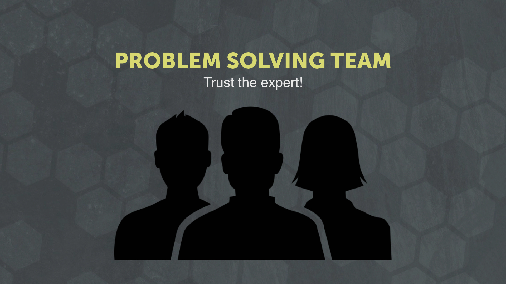

Have you ever had a day like this?

The customer is calling for the twelfth time today to ask you about making a change. The project started out exciting but has now become the biggest drain on your day. Things are out-of-scope and over-budget. The customer is changing everything you present. You’re on revision number twenty-two, and it’s not looking at all like the project you wrote out in the proposal.

What happened here?

How did we get in this situation?

This is the kind of bad day that happens when the customer’s expectations don’t match your expectations.

### We still have days like this, but they are few and far between

After working with a variety of customers for over 18 years, we’ve learned some lessons about making sure our customer relationships run smoothly and leave them happy long after the project is done. Whether it’s b2b or b2c, small-business or big corporation, new startup or old business, these methods can help make your life easier with your customers.

## How to make your customer relationship bullet-proof

### Setting Expectations

We’ve managed to build great customer relationships by taking a very purposeful step at the beginning of every project. We set expectations together with the customer during our strategy workshops. By understanding where a project can potentially be derailed, we address problem areas on the front end.

This gives us leverage when an issue does arise, and we can say, “Hey customer, do you remember the conversation we had about **\_\_**? This is one of those times.” As we present these expectations, we make sure to give the customer space to talk and buy into the idea.

### Trust the Expert

Our “Trust the Expert” expectation has helped us time and time again. Our customers come to us for our expertise and ability in designing and building digital tools. But they are experts on their business and their customers. We establish a “trust the expert” workflow so whenever an issue arises we identify the expert and defer to their direction.

If a customer is asking for something that we know is dysfunctional or outdated, we remind them of this expectation to trust the expert. When building the project, we look to the customer’s expertise on who their customer is and what they need.

### Collaborate

Ultimately this process helps us collaborate more efficiently with our client. In day-to-day terms, this saves us from unnecessary emails, meetings, and phone calls. It also makes our work more enjoyable (which is a core value on our team). We attribute a large part of our success to our customer communication, particularly at the beginning of the relationship.

### Action step: Make This Your Own

If you don’t have a strategy in place for managing customer expectations, here is our designtific recommendation that you can experiment with:

**1. Write out the frequent headaches you have with customers.**

This will look different depending on your customer. We serve people with big ideas and big visions. We often deal with “scope creep,” where our customer’s idea keeps growing throughout the project. We have to manage that early and often.

**2. Communicate how you will handle the conflicts.**

What is your solution to these issues? Write down your answers so the whole team can see them. Then incorporate it into your workflow. Should they be written on your proposals? Should they be scripted for the kickoff meeting? Should they be included in the product documentation?

**3. Test your new process.**

Test your new experiment on your next customer. Record the process and notice if there are any areas that could be improved. Measure how well the project goes. Success might look like less stress, fewer customer complaints, more collaboration, and getting to the finish line quicker.

Are you currently trying to improve how you interact with customers? [Let us know how we can help](http://bit.ly/shform).
