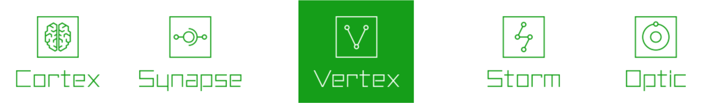
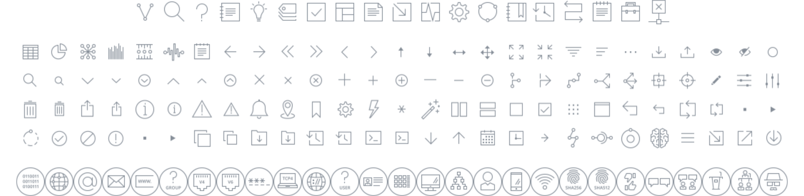
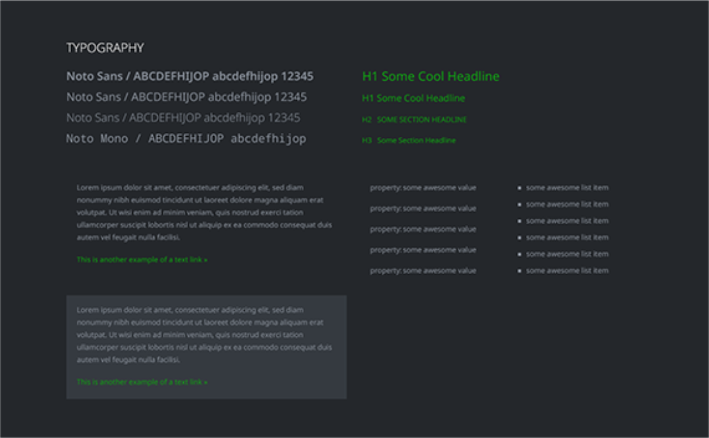
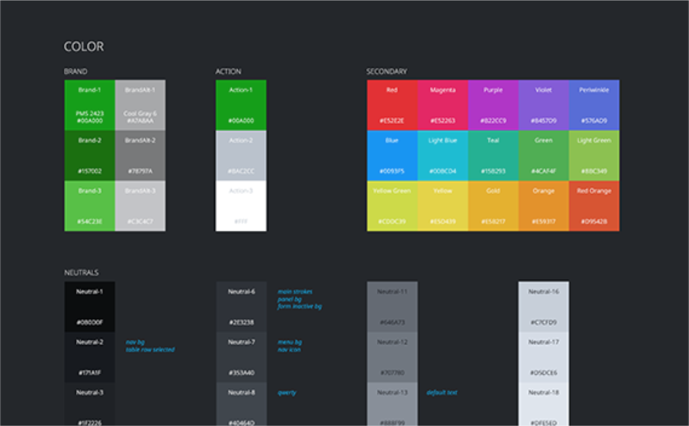
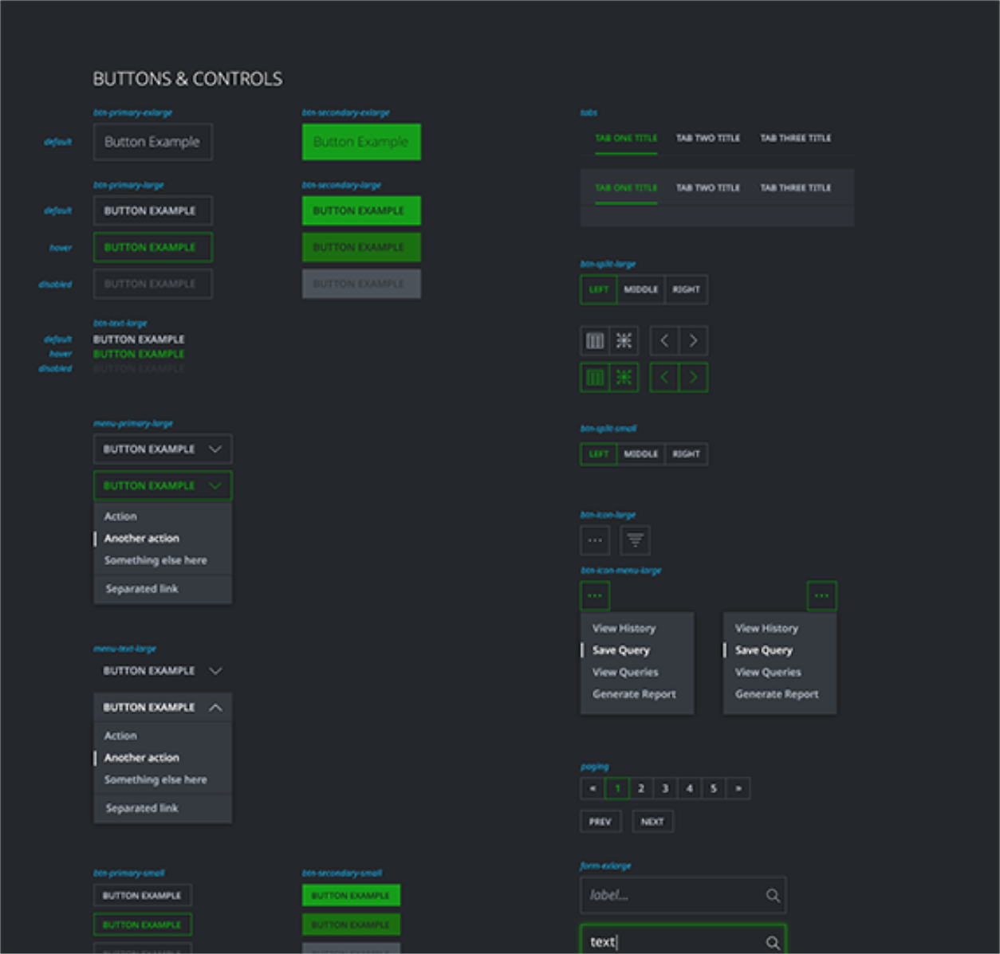
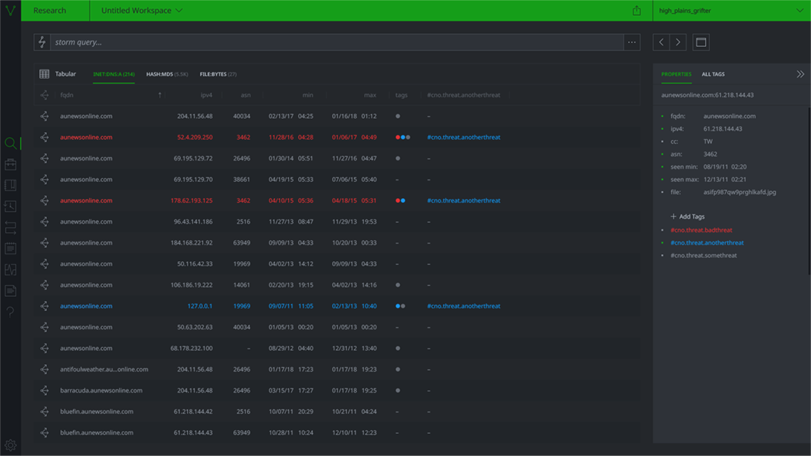
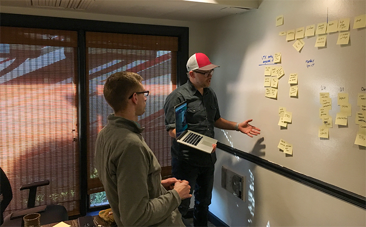
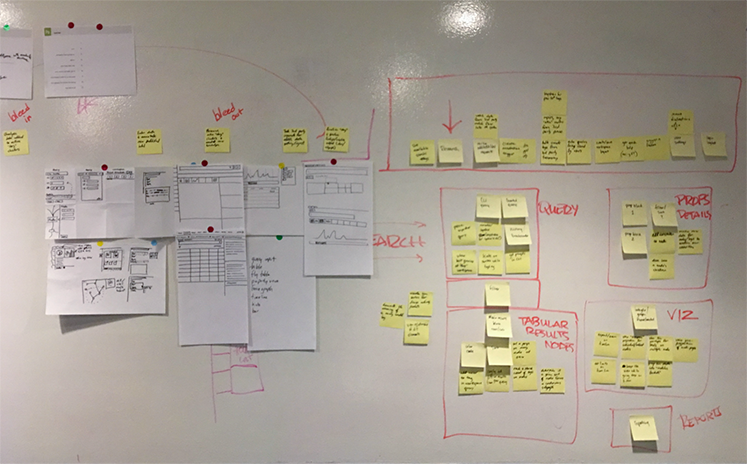
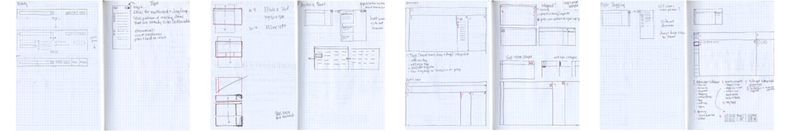

  

##Lorem ipsum
Lorem ipsum dolor sit amet, consectetur adipiscing elit, sed do eiusmod tempor incididunt ut labore et dolore magna aliqua. Ut enim ad minim veniam, quis nostrud exercitation ullamco laboris nisi ut aliquip ex ea commodo consequat. Duis aute irure dolor in reprehenderit in voluptate velit esse cillum dolore eu fugiat nulla pariatur. Excepteur sint occaecat cupidatat non proident, sunt in culpa qui officia deserunt mollit anim id est laborum.

  

    
  

##Since Vertex developed Synapse with a command line interface, it was not accessible to a wide range of users.
Synapse is one of the most powerful data analysis tools currently available. Due to the fact that it was only available through the terminal, it was difficult for new users to learn and use. It took months of training for data analysts to be able to use it, and even more time for them to master it.

To fix this issue, we made an accessible, beginner-friendly interface that can be used by senior analysts who care about efficiency and workflow, as well as by junior analysts and others who only use it occasionally as a part of their job. Optic was born. This has allowed Synapse to move from just being one of the most powerful data analysis platforms to also being the most accessible, a combination that often isn’t seen.

Not only has creating a UI made the platform more accessible to new and current users, but it has also allowed for the addition of new data visualization features not possible in a terminal setting, such as force graph and timeline view (coming soon).

  

    
  

##The Vertex team wanted the app to visually stand out from the competition through its UX and UI.
While there are few big data analysis visualization platforms available, Optic would not have been the first, and the Vertex team didn’t want to be just another platform. They wanted to be the platform—the Photoshop of the data analysis world. They wanted Optic to stand above the others as the industry standard, not only through a simpler interface, but also, and more importantly, through a simpler, more efficient experience.

Several large corporations that use Synapse had developed their own in-house front-ends for it. Not only did Optic need to stand against competitiors, but also against those interfaces built by in-house teams.

In order to do this, we used our Designtific Method, where the needs of our customer’s customers come first. It starts with our Strategy Workshop, where we work with you to determine who your users are, what their needs are, and how we can best meet those needs. We then move on to UX design, where we take what we learned about your users and their needs, and determine the best way to meet those needs through design. We then take that design and turn it into an interactive experience with code.

By doing this, we helped Vertex turn Optic into a source of profit by making an attractive, attention-grabbing interface for current and new users and an efficient user experience simple yet powerful enough to keep them there after they’ve tried it out. We made it stand out from other options via UX by surfacing those killer features that set it apart. We can make your app stand out too.

  
navigation, application, & force graph icons

  

    
  

  
style guide

  

    
    
  

  

    
    
  

##Vertex didn’t want to hire an entire internal team to design and build an application, but they also didn’t have the time to build it themselves.
The Vertex team’s primary focus was on the backend of their app, which left little time to create a front-end. It also didn’t make sense to spend resources hiring and managing an entire in-house team to build their app.

Turning to an outside firm that specializes in UX/UI design as well as app development that could work alongside the current team, and on their own when necessary, was the best option. Off-loading much of the front-end project management to us allowed Vertex more time to focus on other priorities. How much time could you save by having an experienced design/dev partner?

  

    
  

##They wanted a partner that would value their baby as much as they did.
Since Vertex had been working on and investing in Synapse for years, it had become something they felt a personal connection with and they didn’t just want anyone working on it. They wanted a team with experience in and a passion for cybersecurity that would put as much thought and care into the design and development of Optic as they put into the creation of Synapse.

  

    
    
  

  

    
  

##They wanted a fast interface that wouldn’t slow their users down.
The team wanted the limiting factor in productivity for those using the app to be the speed at which they could work, not the speed that data could load onto the screen, or how long it took to work through a form or close a modal. It doesn’t matter how quickly data loads onto the screen if an analyst has to click through 5 forms to accomplish a task, but it also doesn’t matter how quickly a form can be filled out it takes multiple seconds for data to load on each form.

We accomplished this by building a clean, streamlined interface that still keeps a complex set of features surfaced and easy to access.

Sodium Halogen creates seamless UX/UI design which is brought to life via efficient development, making for products with a great user experience and that are a joy to use. This combination is one of the reasons why the Vertex team chose us.

Do you have something that you’d like to build but don’t know how to get started?
[Tell us about your idea]
